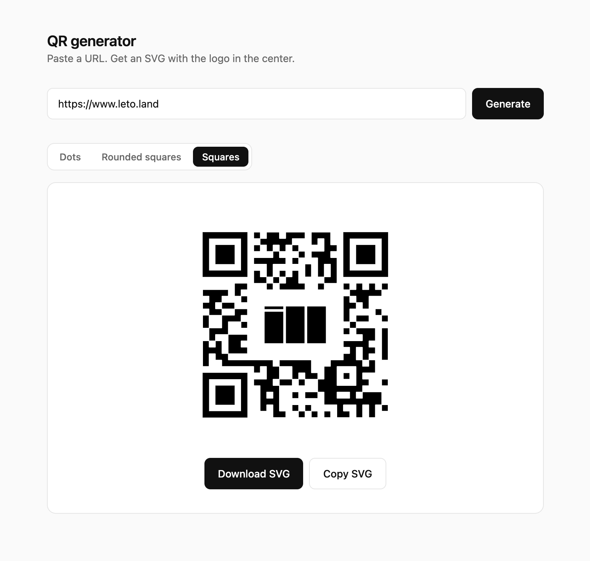

# im-qr

A single-file QR code generator that produces clean SVGs with a logo embedded in the center.

## Features

- **URL → SVG QR code** with high error correction (level H), so the center can be safely covered by the logo
- **Three module styles**: dots, rounded squares, classic squares
- **Shimmer animation** for the dots style with tunable speed, intensity, fade, wave, and randomness
- **Download** as `.svg` or **copy** the SVG markup to clipboard
- No build step, no dependencies beyond a single CDN script (`qrcode-generator`)

## Usage

Open `index.html` in a browser. Paste a URL, click **Generate**, pick a style, and optionally enable the shimmer animation.

## How it works

The center logo sits inside a rounded "knockout" area — modules whose centers fall inside that area are skipped during rendering. The QR's level-H error correction handles the missing data. Finder patterns at the three corners are drawn separately with rounding that matches the chosen module style.

The shimmer animation generates one `<circle>` per module and assigns each a negative `animation-delay` derived from a deterministic wave function over its `(row, column)` position, so the pulse flows organically across the code.
